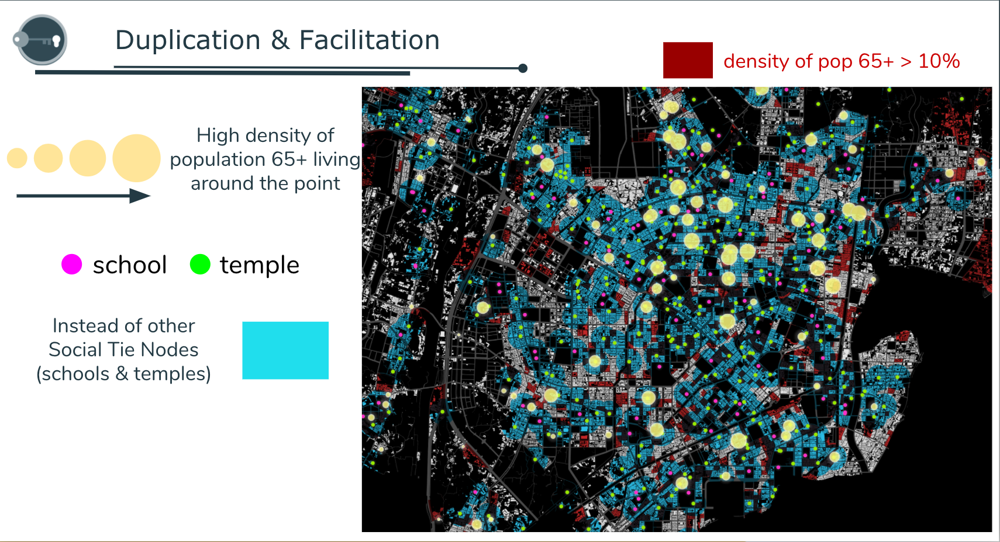

# 2017 Asia Open Data Hackathon(Prototype)

##  Team 
>*Team*  
> ● KOH 
>*Project*  
> ● Support the Ignored Elderly by Spatial Analysis 
>*Member* 
> ● Tim Cho, Angela Liu, Jimmy Kuo, Fantasy Fang 

## Introduce 
> *Subject :* Underprivileged Groups and social welfare
>
> *Problem & Solution :* Our world’s population is aging,and will face a greater need for long-term care.
Therfore,our reserch aims to help the government aid the elderly issues effectively. 
At the same time,we extracted information from open-data including "population statistic", 
"building data", "hospital location" ...ect, and then employed spatial analysis to find out 
which area should get first concern. 
After that, th govenment can not only allocate social resources accurately 
but also meet the physical and mental demand of senior citizen via our research.

## Function 

 

  
   
  <b>[Buffering and clip]</b>

 

 

  
   
  <b>[Intersect and Layers]</b>

 

 

  
   
  <b>[Dissolve and abstract]</b>

 

 

  
   
  <b>[Result]</b>

 
